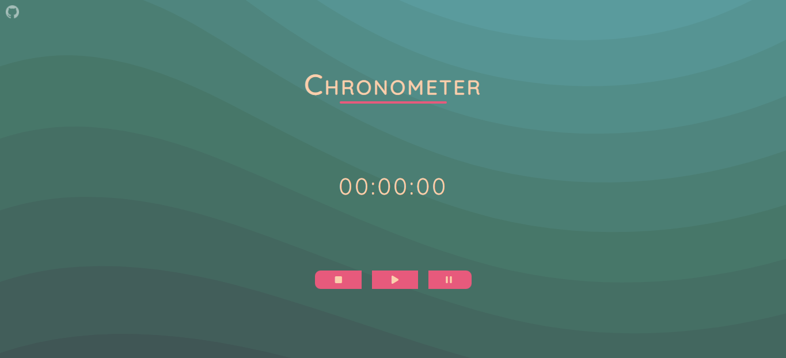

# Chronometer

 ## [SITE HERE](https://isabdch.github.io/chronometer/)

## 📖 Table of Contents

- [Project Description](#project-description)
- [Status](#status)

## ✏️ Project Description

A simple chronometer with play, pause and stop options. 

Project is created with:

- ### HTML

- ### CSS

- ### JavaScript

## ⏱️ Status

This project is finished.
